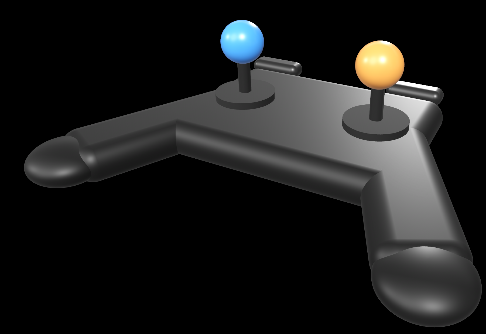
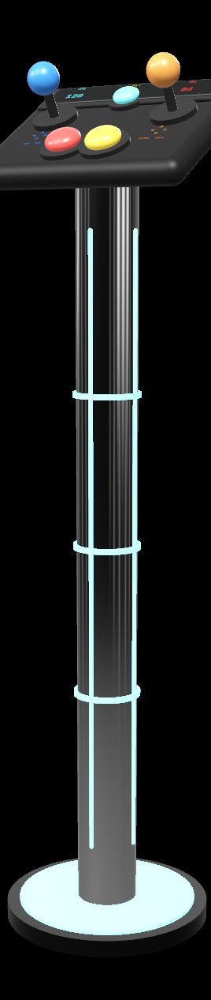

# DicyaninVirtualJoystick

A self-contained Swift package providing a world-anchored 3D virtual joystick rig
for RealityKit on visionOS (and iOS). It gives you two grabbable physics joysticks
— mounted on a flat game-pad body or a floor-standing arcade pillar — whose tilt is
read out as normalized two-stick input you route into your own movement pipeline.

## Preview

<table>
  <tr>
    <td align="center" width="55%"><br><sub><b>Gamepad3DEntity</b> — flat hand-held pad</sub></td>
    <td align="center" width="45%"><br><sub><b>GamepadPillarEntity</b> — arcade stand</sub></td>
  </tr>
</table>

## Features

- **Two physics joysticks** with spring-joint behavior: each stick pivots about its
  base, chases your hand while grabbed, and snaps back to center on release.
- **Two-handed grabbing on device** via hand tracking, so both sticks can be driven
  at once; falls back to a SwiftUI drag gesture in the Simulator.
- **Two rig styles** out of the box: `Gamepad3DEntity` (flat hand-held pad) and
  `GamepadPillarEntity` (arcade stand with fire buttons, axis legends, a CRT readout,
  and a floating holographic minimap).
- **Skins** (`PillarSkin`) for the pillar column + arcade lighting accents.
- **Decoupled by design** — the package never reaches into your app. It talks to the
  host through a single seam, `VirtualJoystickBridge`.

## Installation

Swift Package Manager. Add as a local or remote package dependency, then:

```swift
import DicyaninVirtualJoystick
```

Platforms: visionOS 2.0+, iOS 18.0+.

## Integration

Wire the bridge once at launch:

```swift
// Is the rig the active control scheme right now?
VirtualJoystickBridge.isEnabled = { myControlScheme.usesJoystickRig }

// Per-hand pinch positions for two-handed grabs (device only; nil in Simulator).
VirtualJoystickBridge.handPinchProvider = {
    VirtualJoystickHandPinch(
        left:  myHands.isLeftPinching  ? myHands.leftPinchPosition  : nil,
        right: myHands.isRightPinching ? myHands.rightPinchPosition : nil
    )
}

// Receive the normalized stick output each frame and route it into your movement.
VirtualJoystickBridge.output = { input in
    myController.apply(
        leftDirection: input.leftDirection,  leftMagnitude: input.leftMagnitude,
        rightDirection: input.rightDirection, rightMagnitude: input.rightMagnitude
    )
}
```

Register the system/components at startup and add a rig to your scene:

```swift
Gamepad3DJoystickComponent.registerComponent()
Gamepad3DHeadComponent.registerComponent()
Gamepad3DSystem.registerSystem()

let pillar = GamepadPillarEntity.make()   // or Gamepad3DEntity.make()
rootEntity.addChild(pillar)
```

On the immersive `RealityView`, attach the grab gesture (Simulator drag fallback):

```swift
RealityView { ... }
    .installGamepad3DGesture()
```

## License

MIT
